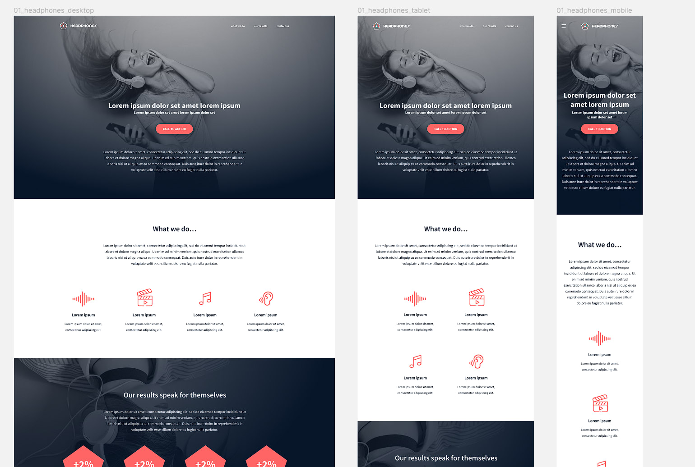

<h1 style="color:#FF6565">Holberton Headphones</h1>
<h2>0x09. Implement a design from scratch</h2>

Building a website the right way based on a figma design:

[Figma design here](https://www.figma.com/file/gkWRcFqkwtruWZgSfnnHF0/Holberton-School---Headphone-company)

Designed by Nicolas Philippot, UI/UX designer and Guillaume Salva, CTO at Holberton School 

#### The goal is to implement the design using :
<ul>
    <li>Pure CSS</li>
    <li>CSS variables</li>
    <li>Simple "as generic as you can" CSS selectors</li>
    <li>avoid super specific CSS selector</li>
    <li>Simple HTML structure</li>
    <li>Accessibility</li>
    <li>Responsive</li>
</ul>

The website should be responsive and as close to design as possible. 

## Author
* **Manuel Torres Vesga** - [matcls](https://github.com/matcls)